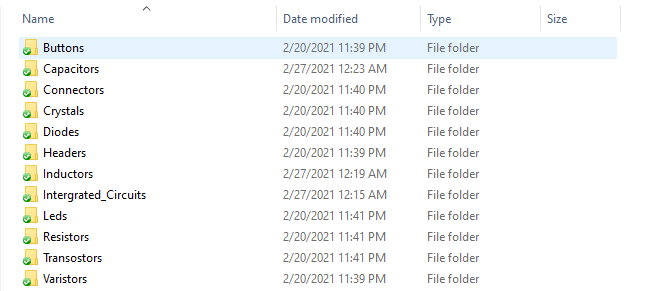

# ORCAD-PCB-FOOTPRINTS-COMPILER
This is ORCAD PCB Footprint libraries files compiler that copies files in different 
folders to a single folder. So in your PCB design settings, you just have to add one single
path. 
##History
During the development of one our project, we downloaded many footprints
files from different websites. Adding each one of them in a single so we can 
update any footprint if needed.

When we finish designing our schematic and wanted to 
develop route our the board we faced some issues for the footprints paths.
Footprints files needed to be in single folder so we can we the the folder path 
to our design configurations. The second option was to copy each 
footprints files to a one folder manually and is time consuming task.
The best solution we can come with was to automate the file copying
process with a software.
###Footprints organization folders

By designing this software we are able to copies all the footprint files
to a single folder. And what we have to do is to simply add one path to 
PCB Editor configurations. 

After an update (Adding new footprints or updating existing footprints) you just need 
compile the files and get everything up to date.

## Building
The sofware is designed with python language and TKinter package and it contains 
two files. One for the graphical interface components and the second for
the files copying.
###Footprints parent and compiled folders
 

#Compiled 
Using the Pyinstaller library we compiled the software to *exe* file 
for window OS so you can just download it and run it. You can also download the 
source code and run it or make some changes if you want.

##Application interface 
 
In the main interface you have two input files where you select the 
the footprints parent folder and the destination source folder.
When everything is setup correctly you can click on the complile button 
to copy the files. At the end of the copying you will see a notification dialog.
## Free to use 
Feel free to use the software for any kind of usage. You can also take contact with me if 
you have similar issues you want to automated. 